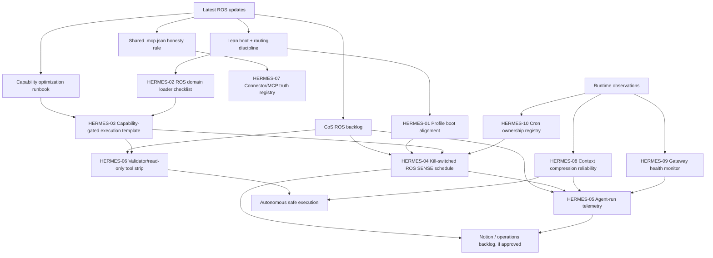

# Hermes for ROS Optimization Backlog
**Date:** 2026-06-27
**Owner:** CoS + Hermes runtime owner
**Scope:** Hermes usage inside Rubin OS (ROS), not generic Hermes product development.
**Source pass:** latest ROS updates, root/system docs, CoS backlog, Hermes runtime status, cron inventory, and current gateway service status.

## 1. Last ROS updates that matter for Hermes

### ROS architecture changed
- ROS now has a stronger cross-agent contract in `/AGENTS.md`: Claude/Cowork, Codex, Hermes, and future agents share one canonical working tree.
- Canonical paths are explicit:
  - Windows: `C:\Users\dguyr\ROS`
  - WSL/Hermes: `/home/guyru/ROS`, symlinked to `/mnt/c/Users/dguyr/ROS`
- Boot is now intentionally lean:
  - Eager: `/AGENTS.md`, `/CLAUDE.md`, `/MEMORY.md`, `/00_System/routing.md`, then routed domain `CLAUDE.md` + `MEMORY.md`.
  - Lazy: capabilities, connectors, filesystem contract, references, templates, projects, and session audit only when needed.
- `/00_System/capability-optimization.md` now defines the ROS capability maturity model and the `SENSE -> FRAME -> DESIGN -> EXECUTE -> JUDGE -> PROMOTE -> AUDIT` optimization loop.
- `/00_System/agent-capabilities.md` now names capability gates: source, freshness, safety, layer fit, evidence, and write-back.
- `.mcp.json` is intentionally conservative: no fabricated MCP servers; actual ROS connector power currently comes through Hermes skills such as `himalaya`, Notion/productivity, and `hermes-agent`.
- `CoS/ROS-BACKLOG.md` now names autonomy and harness items directly relevant to Hermes: Hermes SENSE schedule, validator tool-strip, agent-run telemetry, and safe delegated automations.

### Current Hermes runtime facts observed
- Hermes profiles exist for `cos` and `kk`; both gateways are running under user systemd.
- Active gateway services:
  - `hermes-gateway-cos.service` → profile `cos`
  - `hermes-gateway-kk.service` → profile `kk`
- Active cron jobs:
  - `bc55de81f9f1` — `ROS weekly hygiene audit`, Mondays 08:00, read-only, workdir `/mnt/c/Users/dguyr/ROS`.
  - `c20375b10b15` — `KK-owned weekly Tsagareli Capricorn forecast`, Mondays 10:00.
- Runtime warning observed in current gateway logs: context compression attempted a large OpenRouter request and failed with HTTP 402/token affordability. This is a Hermes-for-ROS reliability issue because long ROS sessions are likely to hit compression often.

## 2. Optimization thesis

Hermes should become the **safe always-on ROS runtime layer**:

1. **Sense** ROS state on a schedule and on demand.
2. **Route** work to the right domain/context without overloading root prompt.
3. **Execute** reversible filesystem and connector tasks with evidence.
4. **Gate** external/financial/irreversible actions to Guy.
5. **Promote** durable learnings into Markdown/Notion, not hidden chat memory.
6. **Measure** agent runs enough to improve cost, latency, failure rate, and quality.

## 3. Graphified dependency map

## 4. Prioritized backlog

| ID | Priority | Item | Current level | Target level | Owner | Dependencies | Next action | Acceptance check |
|---|---|---|---:|---:|---|---|---|---|
| HERMES-01 | P0 | Align Hermes profile boot behavior with `/AGENTS.md` and lazy-load rules | 2 | 3 | CoS + Hermes | Latest AGENTS/CLAUDE docs | Add a compact ROS boot checklist to Hermes-facing ROS docs or a dedicated Hermes ROS runbook | A fresh Hermes ROS session can name exactly which files to eager-load vs lazy-load |
| HERMES-02 | P0 | Build a reusable ROS domain-loader checklist for Hermes tasks | 1 | 3 | CoS + Hermes | HERMES-01 | Create a checklist: route → load domain CLAUDE/MEMORY → inspect project/context → execute → audit | Hermes stops overloading root context and avoids missing domain memory |
| HERMES-03 | P0 | Standardize capability-gated execution template for Hermes | 1 | 3 | CoS + Hermes | `/00_System/capability-optimization.md` | Turn source/freshness/safety/layer/evidence/write-back gates into a reusable Hermes task preflight | Every Hermes ROS artifact names sources, verification, and write-back decision |
| HERMES-04 | P1 | Create a kill-switched ROS SENSE schedule | 1 | 3 | CoS + Hermes | HERMES-02, HERMES-03, cron inventory | Convert the current hygiene audit into a broader read-only SENSE pass or add a separate disabled pilot cron | Weekly output reports drift, stale memory, dirty worktree, service health, and open backlog deltas without edits |
| HERMES-05 | P1 | Add lightweight agent-run telemetry | 0 | 4 | CoS + Hermes | HERMES-04 | Start with Markdown/JSONL run summaries: task, domain, files touched, verification, failure mode, elapsed time | CoS can compare recurring Hermes runs and see failure/cost patterns |
| HERMES-06 | P1 | Define validator/read-only tool strip for Hermes validation runs | 1 | 3 | CoS + Hermes | HERMES-03 | Define which Hermes jobs should use `terminal,file` read-only patterns and which may write | Validator jobs cannot accidentally edit/push while auditing |
| HERMES-07 | P1 | Keep connector/MCP truth registry current | 2 | 3 | CoS + Hermes | `.mcp.json`, `/00_System/connectors.md` | Add a periodic check comparing `.mcp.json`, connectors doc, and Hermes skills actually available | No fabricated MCP entries; connector docs match live access and blockers |
| HERMES-08 | P0 | Fix context compression reliability for long ROS sessions | 1 | 3 | Hermes runtime | Runtime warning from gateway logs | Configure compression/auxiliary model/token budget so long Telegram ROS sessions summarize reliably | No 402/token-affordability compression failures during long ROS work |
| HERMES-09 | P1 | Add gateway health monitor for `cos` + `kk` | 1 | 3 | Hermes runtime | systemd services | Add read-only status/report check for service active state, memory, recent errors | Guy gets alerted only on service failure or repeated warnings, not noisy normal status |
| HERMES-10 | P1 | Document cron ownership and delivery registry | 2 | 3 | CoS + KK + Hermes | Current cron list | Add/maintain a ROS-facing registry of Hermes cron jobs: owner, schedule, workdir, delivery, read/write scope | Agents can tell which automations exist without hidden Hermes state |
| HERMES-11 | P2 | Notion operations backlog bridge | 1 | 3 | CoS + KK | Guy approval for Notion writes | If approved, create Notion task rows for HERMES-01..10; otherwise keep Markdown import pack | Capability backlog becomes visible in the operational layer without duplicating source-of-truth facts |
| HERMES-12 | P2 | Hermes/Codex handoff protocol for shared worktree conflicts | 1 | 3 | CoS + Hermes + Codex | Latest Arbor repo consolidation lessons | Add a small handoff/runbook for active sessions, stale clones, branch/worktree awareness, and safe staging | Hermes does not stage unrelated Claude/Codex work and can detect stale clone risk |

## 5. Execution lanes

### Lane A — Reliability first
1. HERMES-08 context compression reliability.
2. HERMES-09 gateway health monitor.
3. HERMES-10 cron ownership registry.

### Lane B — ROS operating discipline
1. HERMES-01 profile boot alignment.
2. HERMES-02 domain-loader checklist.
3. HERMES-03 capability-gated execution template.

### Lane C — Autonomy pilot
1. HERMES-04 kill-switched ROS SENSE schedule.
2. HERMES-06 validator/read-only tool strip.
3. HERMES-05 lightweight telemetry.

### Lane D — Operations visibility
1. HERMES-11 Notion backlog bridge, only after Guy confirms Notion writes.
2. HERMES-12 shared-worktree handoff protocol.

## 6. Proposed first implementation cut

**Do first without external side effects:**
1. Create `/00_System/hermes-ros-runtime-runbook.md` with:
   - ROS boot checklist for Hermes.
   - Domain-loading checklist.
   - Capability preflight gates.
   - Git staging discipline for shared dirty worktrees.
   - Session-audit wrap-up steps.
2. Add a concise pointer from `/00_System/agent-capabilities.md` or `/AGENTS.md` only if the runbook becomes canonical.
3. Create a read-only script or cron prompt for gateway + cron + git health, disabled by default until Guy approves schedule.
4. Tune compression/auxiliary model settings in the Hermes profile after checking current config and provider budget.

**Gate before doing:**
- Notion writes for backlog rows.
- Cron schedule changes that generate recurring Telegram messages.
- Hermes config changes that affect all `cos` or `kk` sessions.
- Any deletion/cleanup of `.workspace` or stale Arbor clones.

## 7. Decisions for Guy

1. **Backlog surface:** keep this in Markdown only, or also create Notion tasks under the Rubin OS Command Center?
2. **Automation posture:** should HERMES-04 be a disabled pilot first, or should it extend the existing weekly hygiene cron?
3. **Runtime priority:** fix context compression first, or build the ROS runtime runbook first?

Recommendation: **fix HERMES-08 first**, then build the runtime runbook and disabled SENSE pilot. Compression failures create hidden fragility in exactly the long ROS sessions where Hermes is most valuable.
